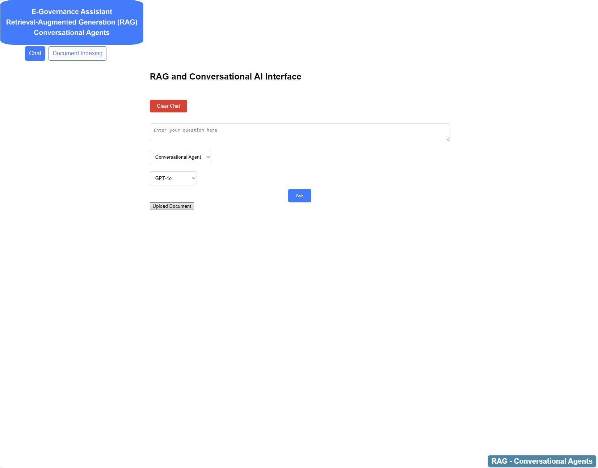

# Enhancing-E-Government-Services-through-a-SOTA-Modular-and-Reproducible-Architecture-over-LLMs

This repository has been established in conjunction with the publication of the research paper titled "Enhancing E-Government Services through a state of the art, modular and reproducible architecture over Large Language Models" and serves as a supplementary resource for researchers interested in creating Multi-Agent systems. Our example use case is dedicated to E-Government Services.

## Introduction

The repository contains a [FastAPI](https://github.com/fastapi/fastapi) application designed to run in Google Colab. It is built using the robust open-source [Haystack](https://github.com/deepset-ai/haystack) framework, which provides an end-to-end solution for large language models (LLMs).

The application offers a web-based interface for interacting with Generative AI models such as GPT-3.5 and GPT-4o, allowing for modular selection of models. It supports various modes for processing questions and answers, including dedicated Retrieval-Augmented Generation (RAG) pipelines for In Memory processing, Research, PressCorner, Web Search, and Conversational Multi-Agent systems. Users can upload files, index their content, and engage in interactive conversations with the Gen AI models of their choice.

## Example Use Case

The use case presented in our research focuses on enhancing E-Government Services through a state-of-the-art, modular, and reproducible architecture utilizing LLMs.

In our example, we use publicly available sources; the [Press Corner](https://ec.europa.eu/commission/presscorner) and the [OECD library](https://www.oecd-ilibrary.org/papers) (restricted to open journal papers), along with Web Search and In Memory capabilities. The data used complies with the terms of use policy, and all appropriate credit goes to the Press Corner and the OECD library. Please note that this repository is not affiliated with, sponsored by, or endorsed by the Press Corner or the OECD library.

Our approach emphasizes modularity and reproducibility, with all pipelines and setups designed to be flexible and customizable. Users can apply different AI models, utilize different vectorized databases, integrate web search tools, implement various preprocessing steps, deploy agents, and define their own data sources.

## Access Instructions

To access the notebook in Google Colab, click the badge below and follow the guidelines:

Example indexing and querying pipelines are set up as demonstrated in our research. For usage, you will need to create your own index. All components are modular and scalable, allowing a variety of vectorized databases, generative AI models, embeddings, prompts, and other elements to be modified as per users' preferences.

## Features

- **File Upload and Indexing**: Supports uploading files in various formats (text, PDF, Word) and indexing their content for efficient retrieval.
- **Dynamic Conversation Interface**: Provides a web-based chat interface for interacting with Gen AI models in real-time.
- **Multiple Processing Modes**: Allows selection of different processing modes and models to customize how questions are handled and answered.
- **In-Memory Processing**: Quickly process and index documents without persistent storage.
- **Research and Presscorner Modes**: Specialized pipelines for handling specific types of queries and data related to E-Government Services.
- **Web Search Integration**: Leverages web search to find relevant information and generate comprehensive answers.
- **Conversational Mode**: Enables dynamic conversations with the Gen AI models, and multiple tools, retaining context and history.

## Web UI example

## Repository Contents

This repository contains the following structure:

- **`RAG_Multi_Agent_demo.ipynb`**: The Jupyter Notebook usable from Google Colab that contains the main code and demonstrations for using the application with documentation.

- **`templates/`**: This directory contains HTML templates used by the FastAPI application to render web pages.

- **`static/`**: This folder includes static files such as CSS, JavaScript, and images that are used in the web interface.

- **`presscorner/`**: A placeholder empty directory intended for resources and data specific to the PressCorner index.

- **`research/`**: A placeholder empty directory designed for resources and data related to the Research index.

- **`images/`**: This directory contains the image used in the README.

## Compliance with AI EU Act

This project is designed with compliance in mind regarding the [European Union's AI Act](https://www.europarl.europa.eu/topics/en/article/20230601STO93804/eu-ai-act-first-regulation-on-artificial-intelligence), both for current use and for future updates as the regulatory landscape evolves. Users who deploy, modify, or extend this application should be aware of the AI EU Act's guidelines and ensure compliance with applicable regulations.